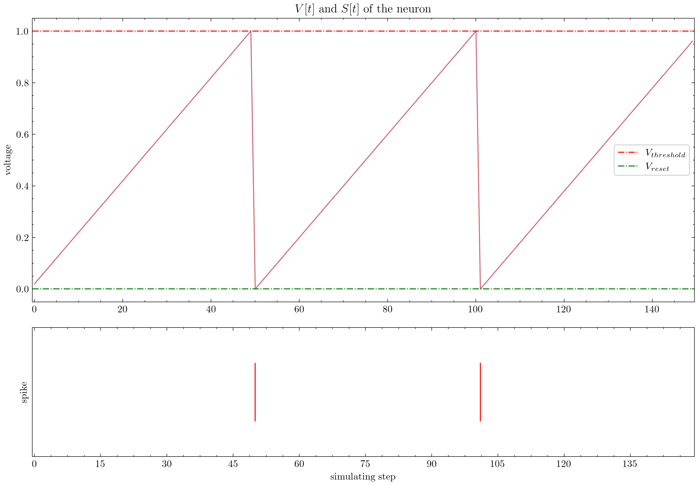
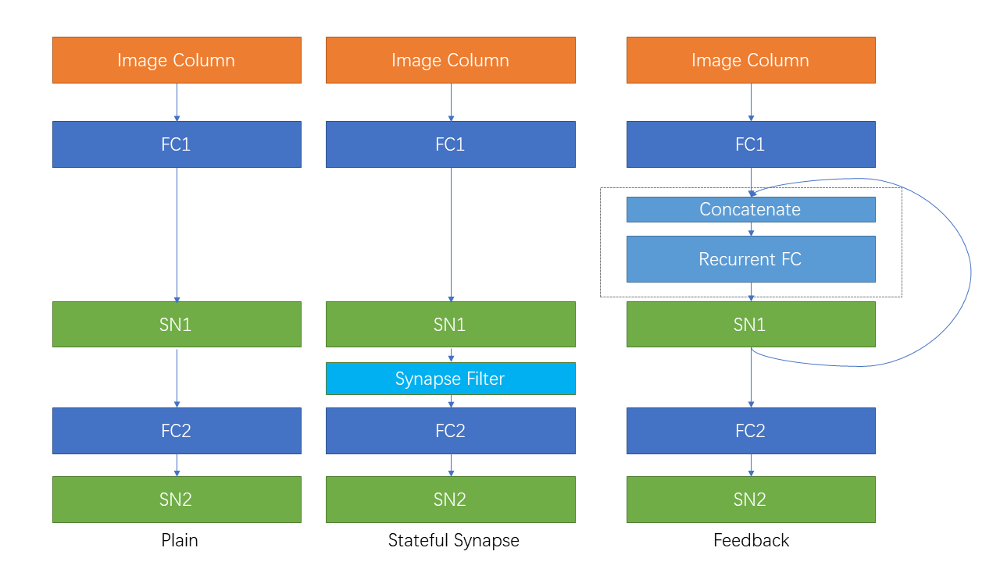

# SpikingJelly
 [](https://spikingjelly.readthedocs.io/zh_CN/latest) [](https://pypi.org/project/spikingjelly) [](https://pypi.org/project/spikingjelly) 

English | [中文](./README_cn.md)


SpikingJelly is an open-source deep learning framework for Spiking Neural Network (SNN) based on [PyTorch](https://pytorch.org/).

The documentation of SpikingJelly is written in both English and Chinese: https://spikingjelly.readthedocs.io.

- [Installation](#installation)
- [Build SNN In An Unprecedented Simple Way](#build-snn-in-an-unprecedented-simple-way)
- [Fast And Handy ANN-SNN Conversion](#fast-and-handy-ann-snn-conversion)
- [CUDA-Enhanced Neuron](#cuda-enhanced-neuron)
- [Device Supports](#device-supports)
- [Neuromorphic Datasets Supports](#neuromorphic-datasets-supports)
- [Tutorials](#Tutorials)
- [Publications and Citation](#publications-and-citation)
- [Contribution](#contribution)
- [About](#about)

## Installation

Note that SpikingJelly is based on PyTorch. Please make sure that you have installed PyTorch before you install SpikingJelly.

The odd version number is the developing version, which is updated with GitHub/OpenI repository. The even version number is the stable version and available at PyPI. 

Note that the default doc is for the latest developing version. If you are using the  stable version, do not forget to switch to the doc in the corresponding version: https://spikingjelly.readthedocs.io/zh_CN/0.0.0.0.12/.

**Install the last stable version from** [**PyPI**](https://pypi.org/project/spikingjelly/):

```bash
pip install spikingjelly
```

**Install the latest developing version from the source codes**:

From [GitHub](https://github.com/fangwei123456/spikingjelly):
```bash
git clone https://github.com/fangwei123456/spikingjelly.git
cd spikingjelly
python setup.py install
```
From [OpenI](https://git.openi.org.cn/OpenI/spikingjelly):
```bash
git clone https://git.openi.org.cn/OpenI/spikingjelly.git
cd spikingjelly
python setup.py install
```
If you use an old version of SpikingJelly, you may meet some fatal bugs. Refer to [Bugs History with Releases](./bugs.md) for more details.

## Build SNN In An Unprecedented Simple Way

SpikingJelly is user-friendly. Building SNN with SpikingJelly is as simple as building ANN in PyTorch:

```python
nn.Sequential(
        layer.Flatten(),
        layer.Linear(28 * 28, 10, bias=False),
        neuron.LIFNode(tau=tau, surrogate_function=surrogate.ATan())
        )
```

This simple network with a Poisson encoder can achieve 92% accuracy on MNIST test dataset. Read [the tutorial of clock driven](https://spikingjelly.readthedocs.io/zh_CN/latest/tutorial_en.activation_based.html) for more details. You can also run this code in Python terminal for training on classifying MNIST:

```python
python -m spikingjelly.activation_based.examples.lif_fc_mnist -tau 2.0 -T 100 -device cuda:0 -b 64 -epochs 100 -data-dir <PATH to MNIST> -amp -opt adam -lr 1e-3 -j 8
```

## Fast And Handy ANN-SNN Conversion

SpikingJelly implements a relatively general ANN-SNN Conversion interface. Users can realize the conversion through PyTorch. What's more, users can customize the conversion mode. 

```python
class ANN(nn.Module):
    def __init__(self):
        super().__init__()
        self.network = nn.Sequential(
            nn.Conv2d(1, 32, 3, 1),
            nn.BatchNorm2d(32, eps=1e-3),
            nn.ReLU(),
            nn.AvgPool2d(2, 2),

            nn.Conv2d(32, 32, 3, 1),
            nn.BatchNorm2d(32, eps=1e-3),
            nn.ReLU(),
            nn.AvgPool2d(2, 2),

            nn.Conv2d(32, 32, 3, 1),
            nn.BatchNorm2d(32, eps=1e-3),
            nn.ReLU(),
            nn.AvgPool2d(2, 2),

            nn.Flatten(),
            nn.Linear(32, 10)
        )

    def forward(self,x):
        x = self.network(x)
        return x
```

This simple network with analog encoding can achieve 98.44% accuracy after converiosn on MNIST test dataset. Read [the tutorial of ann2snn](https://spikingjelly.readthedocs.io/zh_CN/latest/activation_based/5_ann2snn.html) for more details. You can also run this code in Python terminal for training on classifying MNIST using converted model:

```python
>>> import spikingjelly.activation_based.ann2snn.examples.cnn_mnist as cnn_mnist
>>> cnn_mnist.main()
```

## CUDA-Enhanced Neuron

SpikingJelly provides two backends for multi-step neurons (read [Tutorials](#Tutorials) for more details). You can use the user-friendly `torch` backend for easily codding and debugging, and use `cupy` backend for faster training speed.

The followed figure compares execution time of two backends of Multi-Step LIF neurons (`float32`):


`float16` is also provided by the `cupy` backend and can be used in [automatic mixed precision training](https://pytorch.org/docs/stable/notes/amp_examples.html).

To use the `cupy` backend, please install [CuPy](https://docs.cupy.dev/en/stable/install.html). Note that the `cupy` backend only supports GPU, while the `torch` backend supports both CPU and GPU.

## Device Supports

-   [x] Nvidia GPU
-   [x] CPU

As simple as using PyTorch.

```python
>>> net = nn.Sequential(layer.Flatten(), layer.Linear(28 * 28, 10, bias=False), neuron.LIFNode(tau=tau))
>>> net = net.to(device) # Can be CPU or CUDA devices
```

## Neuromorphic Datasets Supports
SpikingJelly includes the following neuromorphic datasets:

| Dataset | Source |
| -------------- | ------------------------------------------------------------ |
| ASL-DVS        | [Graph-based Object Classification for Neuromorphic Vision Sensing](https://openaccess.thecvf.com/content_ICCV_2019/html/Bi_Graph-Based_Object_Classification_for_Neuromorphic_Vision_Sensing_ICCV_2019_paper.html) |
| CIFAR10-DVS    | [CIFAR10-DVS: An Event-Stream Dataset for Object Classification](https://internal-journal.frontiersin.org/articles/10.3389/fnins.2017.00309/full) |
| DVS128 Gesture | [A Low Power, Fully Event-Based Gesture Recognition System](https://openaccess.thecvf.com/content_cvpr_2017/html/Amir_A_Low_Power_CVPR_2017_paper.html) |
| ES-ImageNet    | [ES-ImageNet: A Million Event-Stream Classification Dataset for Spiking Neural Networks](https://www.frontiersin.org/articles/10.3389/fnins.2021.726582/full) |
| N-Caltech101   | [Converting Static Image Datasets to Spiking Neuromorphic Datasets Using Saccades](https://www.frontiersin.org/articles/10.3389/fnins.2015.00437/full) |
| N-MNIST        | [Converting Static Image Datasets to Spiking Neuromorphic Datasets Using Saccades](https://www.frontiersin.org/articles/10.3389/fnins.2015.00437/full) |
| Nav Gesture    | [Event-Based Gesture Recognition With Dynamic Background Suppression Using Smartphone Computational Capabilities](https://www.frontiersin.org/articles/10.3389/fnins.2020.00275/full) |

Users can use both the origin events data and frames data integrated by SpikingJelly:

```python
import torch
from torch.utils.data import DataLoader
from spikingjelly.datasets import pad_sequence_collate, padded_sequence_mask
from spikingjelly.datasets.dvs128_gesture import DVS128Gesture
root_dir = 'D:/datasets/DVS128Gesture'
event_set = DVS128Gesture(root_dir, train=True, data_type='event')
event, label = event_set[0]
for k in event.keys():
    print(k, event[k])

# t [80048267 80048277 80048278 ... 85092406 85092538 85092700]
# x [49 55 55 ... 60 85 45]
# y [82 92 92 ... 96 86 90]
# p [1 0 0 ... 1 0 0]
# label 0

fixed_frames_number_set = DVS128Gesture(root_dir, train=True, data_type='frame', frames_number=20, split_by='number')
rand_index = torch.randint(low=0, high=fixed_frames_number_set.__len__(), size=[2])
for i in rand_index:
    frame, label = fixed_frames_number_set[i]
    print(f'frame[{i}].shape=[T, C, H, W]={frame.shape}')

# frame[308].shape=[T, C, H, W]=(20, 2, 128, 128)
# frame[453].shape=[T, C, H, W]=(20, 2, 128, 128)

fixed_duration_frame_set = DVS128Gesture(root_dir, data_type='frame', duration=1000000, train=True)
for i in range(5):
    x, y = fixed_duration_frame_set[i]
    print(f'x[{i}].shape=[T, C, H, W]={x.shape}')

# x[0].shape=[T, C, H, W]=(6, 2, 128, 128)
# x[1].shape=[T, C, H, W]=(6, 2, 128, 128)
# x[2].shape=[T, C, H, W]=(5, 2, 128, 128)
# x[3].shape=[T, C, H, W]=(5, 2, 128, 128)
# x[4].shape=[T, C, H, W]=(7, 2, 128, 128)

train_data_loader = DataLoader(fixed_duration_frame_set, collate_fn=pad_sequence_collate, batch_size=5)
for x, y, x_len in train_data_loader:
    print(f'x.shape=[N, T, C, H, W]={tuple(x.shape)}')
    print(f'x_len={x_len}')
    mask = padded_sequence_mask(x_len)  # mask.shape = [T, N]
    print(f'mask=\n{mask.t().int()}')
    break

# x.shape=[N, T, C, H, W]=(5, 7, 2, 128, 128)
# x_len=tensor([6, 6, 5, 5, 7])
# mask=
# tensor([[1, 1, 1, 1, 1, 1, 0],
#         [1, 1, 1, 1, 1, 1, 0],
#         [1, 1, 1, 1, 1, 0, 0],
#         [1, 1, 1, 1, 1, 0, 0],
#         [1, 1, 1, 1, 1, 1, 1]], dtype=torch.int32)
```
More datasets will be included in the future.

If some datasets' download link are not available for some users, the users can download from the OpenI mirror:

https://git.openi.org.cn/OpenI/spikingjelly/datasets?type=0

All datasets saved in the OpenI mirror are allowable by their licence or authors' agreement.

## Tutorials

SpikingJelly provides elaborate tutorials. Here are some of tutorials:

| Figure                                                       | Tutorial                                                     |
| ------------------------------------------------------------ | ------------------------------------------------------------ |
|  | [Basic Conception](https://spikingjelly.readthedocs.io/zh_CN/latest/activation_based_en/basic_concept.html) |
|  | [Neuron](https://spikingjelly.readthedocs.io/zh_CN/latest/activation_based_en/neuron.html) |
|  | [Use single-layer fully connected SNN to identify MNIST(old version, the new version is under developing)](https://spikingjelly.readthedocs.io/zh_CN/0.0.0.0.12/clock_driven_en/3_fc_mnist.html) |
|  | [Convolutional SNN to Classify FMNIST](https://spikingjelly.readthedocs.io/zh_CN/latest/activation_based_en/conv_fashion_mnist.html) |
|  | [ANN2SNN(old version, the new version is under developing)](https://spikingjelly.readthedocs.io/zh_CN/0.0.0.0.12/clock_driven_en/5_ann2snn.html) |
|  | [Neuromorphic Datasets Processing](https://spikingjelly.readthedocs.io/zh_CN/latest/activation_based_en/neuromorphic_datasets.html) |
|  | [Classify DVS Gesture](https://spikingjelly.readthedocs.io/zh_CN/latest/activation_based_en/classify_dvsg.html) |
|  | [Recurrent Connection and Stateful Synapse](https://spikingjelly.readthedocs.io/zh_CN/latest/activation_based_en/recurrent_connection_and_stateful_synapse.html) |
|  | [STDP Learning](https://spikingjelly.readthedocs.io/zh_CN/latest/activation_based_en/stdp.html) |

Other tutorials that are not listed here are also available at the document https://spikingjelly.readthedocs.io.

## Publications and Citation

Publications using SpikingJelly are recorded in [Publications](./publications.md). If you use SpikingJelly in your paper, you can also add it to this table by pull request.

If you use SpikingJelly in your work, please cite it as follows:

```
@misc{SpikingJelly,
	title = {SpikingJelly},
	author = {Fang, Wei and Chen, Yanqi and Ding, Jianhao and Chen, Ding and Yu, Zhaofei and Zhou, Huihui and Tian, Yonghong and other contributors},
	year = {2020},
	howpublished = {\url{https://github.com/fangwei123456/spikingjelly}},
	note = {Accessed: YYYY-MM-DD},
}
```

Note: To specify the version of framework you are using, the default value `YYYY-MM-DD` in the `note` field should be replaced with the date of the last change of the framework you are using, i.e. the date of the latest commit.

## Contribution

You can read the issues and get the problems to be solved and latest development plans. We welcome all users to join the discussion of development plans, solve issues, and send pull requests.

Not all API documents are written in both English and Chinese. We welcome users to complete translation (from English to Chinese, or from Chinese to English).

## About

[Multimedia Learning Group, Institute of Digital Media (NELVT), Peking University](https://pkuml.org/) and [Peng Cheng Laboratory](http://www.szpclab.com/) are the main developers of SpikingJelly.


The list of developers can be found [here](https://github.com/fangwei123456/spikingjelly/graphs/contributors).

