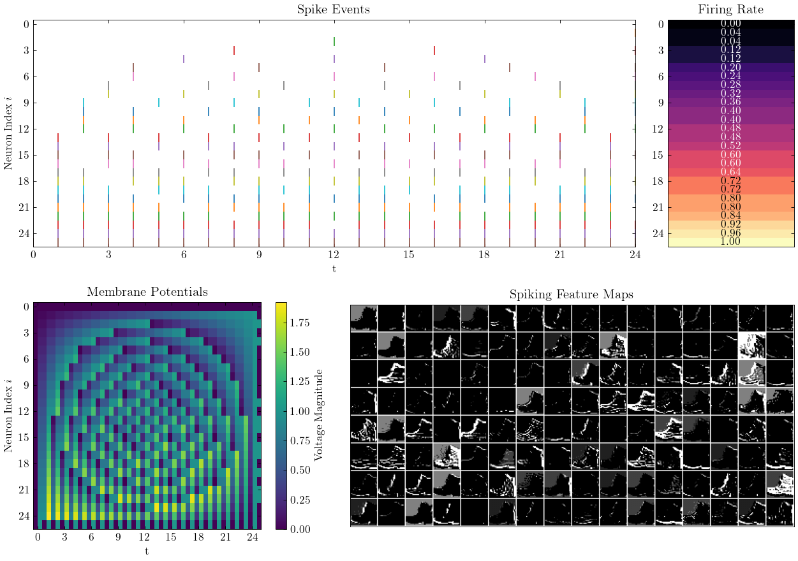
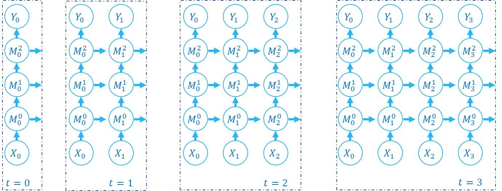
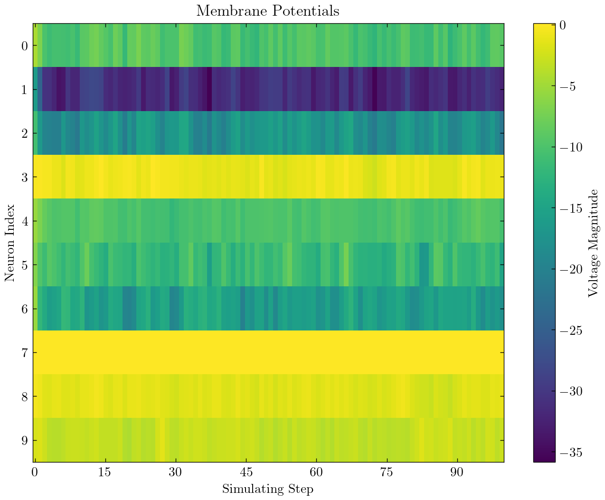
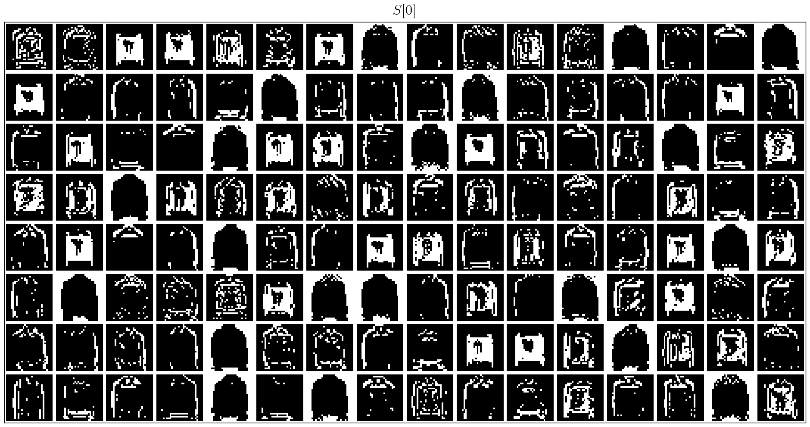
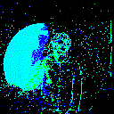
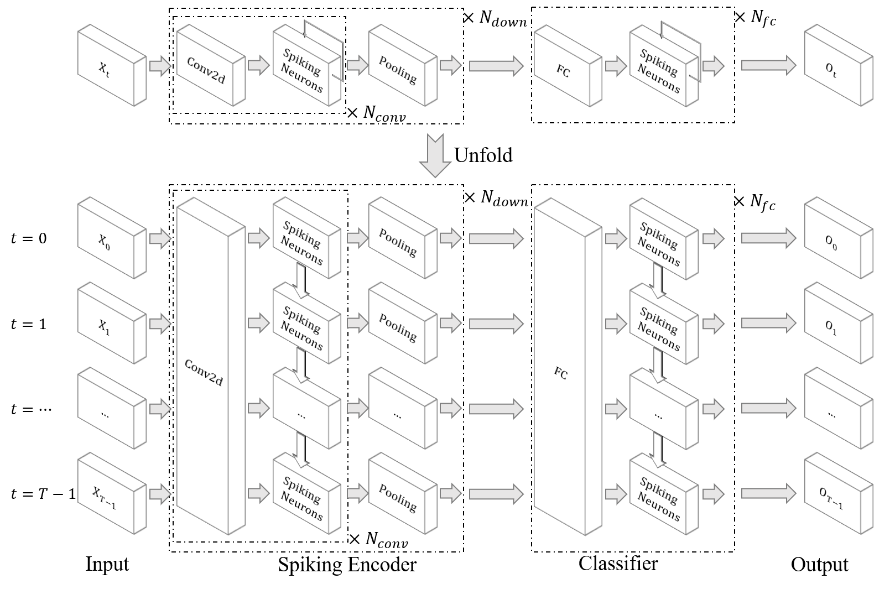

# 惊蜇(SpikingJelly)
 [](https://spikingjelly.readthedocs.io/zh_CN/latest) [](https://pypi.org/project/spikingjelly) [](https://pypi.org/project/spikingjelly) 

[English](./README.md) | 中文



[SpikingJelly](https://github.com/fangwei123456/spikingjelly) 是一个基于 [PyTorch](https://pytorch.org/) ，使用脉冲神经网络(Spiking Neural Network, SNN)进行深度学习的框架。

SpikingJelly的文档使用中英双语编写： https://spikingjelly.readthedocs.io。

- [安装](#安装)
- [以前所未有的简单方式搭建SNN](#以前所未有的简单方式搭建SNN)
- [快速好用的ANN-SNN转换](#快速好用的ANN-SNN转换)
- [CUDA增强的神经元](#CUDA增强的神经元)
- [设备支持](#设备支持)
- [神经形态数据集支持](#神经形态数据集支持)
- [教程](#教程)
- [出版物与引用](#出版物与引用)
- [贡献](#贡献)
- [项目信息](#项目信息)

## 安装

注意，SpikingJelly是基于PyTorch的，需要确保环境中已经安装了PyTorch，才能安装SpikingJelly。

奇数版本是开发版，随着GitHub/OpenI不断更新。偶数版本是稳定版，可以从PyPI获取。

**从** [**PyPI**](https://pypi.org/project/spikingjelly/) **安装最新的稳定版本**：

```bash
pip install spikingjelly
```

**从源代码安装最新的开发版**：

通过[GitHub](https://github.com/fangwei123456/spikingjelly)：
```bash
git clone https://github.com/fangwei123456/spikingjelly.git
cd spikingjelly
python setup.py install
```
通过[OpenI](https://git.openi.org.cn/OpenI/spikingjelly):
```bash
git clone https://git.openi.org.cn/OpenI/spikingjelly.git
cd spikingjelly
python setup.py install
```
如果使用老版本的SpikingJelly，则有可能遇到一些致命的bugs。参见[Bugs History with Releases](./bugs.md) 。推荐使用最新的稳定版或开发版。

## 以前所未有的简单方式搭建SNN

SpikingJelly非常易于使用。使用SpikingJelly搭建SNN，就像使用PyTorch搭建ANN一样简单：

```python
nn.Sequential(
        layer.Flatten(),
        layer.Linear(28 * 28, 10, bias=False),
        neuron.LIFNode(tau=tau, surrogate_function=surrogate.ATan())
        )
```

这个简单的网络，使用泊松编码器，在MNIST的测试集上可以达到92%的正确率。 更多信息，参见[时间驱动的教程](https://spikingjelly.readthedocs.io/zh_CN/latest/tutorial.activation_based.html)。您还可以在Python中运行以下代码，以使用转换后的模型对MNIST进行分类：

```python
python -m spikingjelly.activation_based.examples.lif_fc_mnist -tau 2.0 -T 100 -device cuda:0 -b 64 -epochs 100 -data-dir <PATH to MNIST> -amp -opt adam -lr 1e-3 -j 8
```

## 快速好用的ANN-SNN转换

SpikingJelly实现了一个相对通用的ANN-SNN转换接口。此外，用户可以自定义转换模块以添加到转换中。

```python
class ANN(nn.Module):
    def __init__(self):
        super().__init__()
        self.network = nn.Sequential(
            nn.Conv2d(1, 32, 3, 1),
            nn.BatchNorm2d(32, eps=1e-3),
            nn.ReLU(),
            nn.AvgPool2d(2, 2),

            nn.Conv2d(32, 32, 3, 1),
            nn.BatchNorm2d(32, eps=1e-3),
            nn.ReLU(),
            nn.AvgPool2d(2, 2),

            nn.Conv2d(32, 32, 3, 1),
            nn.BatchNorm2d(32, eps=1e-3),
            nn.ReLU(),
            nn.AvgPool2d(2, 2),

            nn.Flatten(),
            nn.Linear(32, 10),
            nn.ReLU()
        )

    def forward(self,x):
        x = self.network(x)
        return x
```

在MNIST测试数据集上进行收敛之后，这种具有模拟编码的简单网络可以达到98.51％的精度。有关更多详细信息，请阅读[ann2snn的教程](https://spikingjelly.readthedocs.io/zh_CN/latest/activation_based/5_ann2snn.html)。可以在Python命令行中通过如下命令，在MNIST上使用ANN2SNN：

```python
>>> import spikingjelly.activation_based.ann2snn.examples.cnn_mnist as cnn_mnist
>>> cnn_mnist.main()
```

## CUDA增强的神经元

SpikingJelly为部分神经元提供给了2种后端。可以使用对用户友好的`torch`后端进行快速开发，并使用`cupy`后端进行高效训练。

下图对比了2种后端的LIF神经元 (`float32`) 在多步模式下的运行时长：


`cupy`后端同样接支持`float16`，并且可以在[自动混合精度训练](https://pytorch.org/docs/stable/notes/amp_examples.html)中使用。

若想使用`cupy`后端，请安装 [CuPy](https://docs.cupy.dev/en/stable/install.html)。`cupy`后端仅支持GPU，而`torch`后端同时支持CPU和GPU。

## 设备支持

-   [x] Nvidia GPU
-   [x] CPU

像使用PyTorch一样简单。

```python
>>> net = nn.Sequential(layer.Flatten(), layer.Linear(28 * 28, 10, bias=False), neuron.LIFNode(tau=tau))
>>> net = net.to(device) # Can be CPU or CUDA devices
```

## 神经形态数据集支持
SpikingJelly 已经将下列数据集纳入：

| 数据集         | 来源                                                         |
| -------------- | ------------------------------------------------------------ |
| ASL-DVS        | [Graph-based Object Classification for Neuromorphic Vision Sensing](https://openaccess.thecvf.com/content_ICCV_2019/html/Bi_Graph-Based_Object_Classification_for_Neuromorphic_Vision_Sensing_ICCV_2019_paper.html) |
| CIFAR10-DVS    | [CIFAR10-DVS: An Event-Stream Dataset for Object Classification](https://internal-journal.frontiersin.org/articles/10.3389/fnins.2017.00309/full) |
| DVS128 Gesture | [A Low Power, Fully Event-Based Gesture Recognition System](https://openaccess.thecvf.com/content_cvpr_2017/html/Amir_A_Low_Power_CVPR_2017_paper.html) |
| ES-ImageNet    | [ES-ImageNet: A Million Event-Stream Classification Dataset for Spiking Neural Networks](https://www.frontiersin.org/articles/10.3389/fnins.2021.726582/full) |
| N-Caltech101   | [Converting Static Image Datasets to Spiking Neuromorphic Datasets Using Saccades](https://www.frontiersin.org/articles/10.3389/fnins.2015.00437/full) |
| N-MNIST        | [Converting Static Image Datasets to Spiking Neuromorphic Datasets Using Saccades](https://www.frontiersin.org/articles/10.3389/fnins.2015.00437/full) |
| Nav Gesture    | [Event-Based Gesture Recognition With Dynamic Background Suppression Using Smartphone Computational Capabilities](https://www.frontiersin.org/articles/10.3389/fnins.2020.00275/full) |

用户可以轻松使用事件数据，或由SpikingJelly积分生成的帧数据：

```python
import torch
from torch.utils.data import DataLoader
from spikingjelly.datasets import pad_sequence_collate, padded_sequence_mask
from spikingjelly.datasets.dvs128_gesture import DVS128Gesture
root_dir = 'D:/datasets/DVS128Gesture'
event_set = DVS128Gesture(root_dir, train=True, data_type='event')
event, label = event_set[0]
for k in event.keys():
    print(k, event[k])

# t [80048267 80048277 80048278 ... 85092406 85092538 85092700]
# x [49 55 55 ... 60 85 45]
# y [82 92 92 ... 96 86 90]
# p [1 0 0 ... 1 0 0]
# label 0

fixed_frames_number_set = DVS128Gesture(root_dir, train=True, data_type='frame', frames_number=20, split_by='number')
rand_index = torch.randint(low=0, high=fixed_frames_number_set.__len__(), size=[2])
for i in rand_index:
    frame, label = fixed_frames_number_set[i]
    print(f'frame[{i}].shape=[T, C, H, W]={frame.shape}')

# frame[308].shape=[T, C, H, W]=(20, 2, 128, 128)
# frame[453].shape=[T, C, H, W]=(20, 2, 128, 128)

fixed_duration_frame_set = DVS128Gesture(root_dir, data_type='frame', duration=1000000, train=True)
for i in range(5):
    x, y = fixed_duration_frame_set[i]
    print(f'x[{i}].shape=[T, C, H, W]={x.shape}')

# x[0].shape=[T, C, H, W]=(6, 2, 128, 128)
# x[1].shape=[T, C, H, W]=(6, 2, 128, 128)
# x[2].shape=[T, C, H, W]=(5, 2, 128, 128)
# x[3].shape=[T, C, H, W]=(5, 2, 128, 128)
# x[4].shape=[T, C, H, W]=(7, 2, 128, 128)

train_data_loader = DataLoader(fixed_duration_frame_set, collate_fn=pad_sequence_collate, batch_size=5)
for x, y, x_len in train_data_loader:
    print(f'x.shape=[N, T, C, H, W]={tuple(x.shape)}')
    print(f'x_len={x_len}')
    mask = padded_sequence_mask(x_len)  # mask.shape = [T, N]
    print(f'mask=\n{mask.t().int()}')
    break

# x.shape=[N, T, C, H, W]=(5, 7, 2, 128, 128)
# x_len=tensor([6, 6, 5, 5, 7])
# mask=
# tensor([[1, 1, 1, 1, 1, 1, 0],
#         [1, 1, 1, 1, 1, 1, 0],
#         [1, 1, 1, 1, 1, 0, 0],
#         [1, 1, 1, 1, 1, 0, 0],
#         [1, 1, 1, 1, 1, 1, 1]], dtype=torch.int32)
```

未来将会纳入更多数据集。

如果用户无法下载某些数据集，可以尝试从OpenI的数据集镜像下载：

https://git.openi.org.cn/OpenI/spikingjelly/datasets?type=0

只有原始数据集所使用的协议允许分发，或原始数据集作者已经同意分发的数据集才会被建立镜像。 

## 教程

SpikingJelly精心准备了多项教程。下面展示了**部分**教程：

| 图例                                                         | 教程                                                         |
| ------------------------------------------------------------ | ------------------------------------------------------------ |
|  | [基本概念](https://spikingjelly.readthedocs.io/zh_CN/latest/activation_based/basic_concept.html) |
|  | [神经元](https://spikingjelly.readthedocs.io/zh_CN/latest/activation_based/neuron.html) |
|  | [使用单层全连接SNN识别MNIST](https://spikingjelly.readthedocs.io/zh_CN/latest/activation_based/lif_fc_mnist.html) |
|  | [使用卷积SNN识别Fashion-MNIST](https://spikingjelly.readthedocs.io/zh_CN/latest/activation_based/conv_fashion_mnist.html) |
|  | [ANN2SNN(老版本教程，新版编写中)](https://spikingjelly.readthedocs.io/zh_CN/0.0.0.0.12/clock_driven/5_ann2snn.html) |
|  | [神经形态数据集处理](https://spikingjelly.readthedocs.io/zh_CN/latest/activation_based/neuromorphic_datasets.html) |
|  | [分类DVS128 Gesture](https://spikingjelly.readthedocs.io/zh_CN/latest/activation_based/classify_dvsg.html) |
|  | [自连接和有状态突触](https://spikingjelly.readthedocs.io/zh_CN/latest/activation_based/recurrent_connection_and_stateful_synapse.html) |

其他没有列出在此处的教程可以在文档 https://spikingjelly.readthedocs.io 中获取。

## 出版物与引用

[出版物列表](./publications.md)中保存了已知的使用惊蜇(SpikingJelly)的出版物。如果你的文章也使用了惊蜇(SpikingJelly)，可以通过提交pull request的方式来更新出版物列表。

如果您在自己的工作中用到了惊蜇(SpikingJelly)，您可以按照下列格式进行引用：

```
@misc{SpikingJelly,
	title = {SpikingJelly},
	author = {Fang, Wei and Chen, Yanqi and Ding, Jianhao and Chen, Ding and Yu, Zhaofei and Zhou, Huihui and Tian, Yonghong and other contributors},
	year = {2020},
	howpublished = {\url{https://github.com/fangwei123456/spikingjelly}},
	note = {Accessed: YYYY-MM-DD},
}
```

注意：为了表明您所使用的框架代码版本，`note` 字段中的缺省日期 `YYYY-MM-DD` 应当被替换为您所使用的框架代码最近一次更新的日期（即最新一次commit的日期）。

## 贡献

可以通过阅读issues来获取目前尚未解决的问题和开发计划。我们非常欢迎各位用户参与讨论、解决问题和提交pull requests。

因开发者精力有限，惊蜇(SpikingJelly)的API文档并没有被中英双语完全覆盖，我们非常欢迎各位用户参与翻译补全工作（中译英、英译中）。

## 项目信息

北京大学信息科学技术学院数字媒体所媒体学习组 [Multimedia Learning Group](https://pkuml.org/) 和 [鹏城实验室](https://www.pcl.ac.cn/) 是SpikingJelly的主要开发者。


开发人员名单可以在[这里](https://github.com/fangwei123456/spikingjelly/graphs/contributors)找到。

